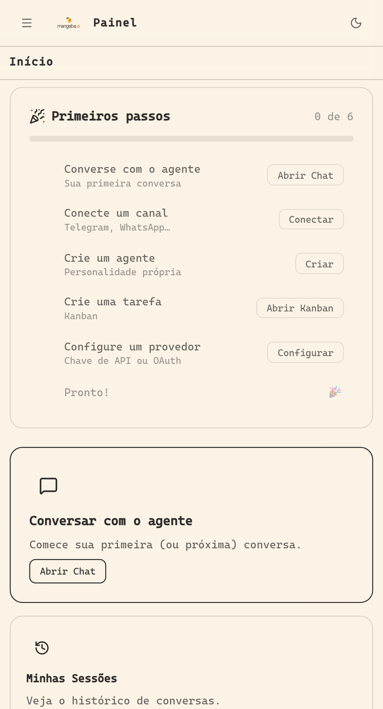
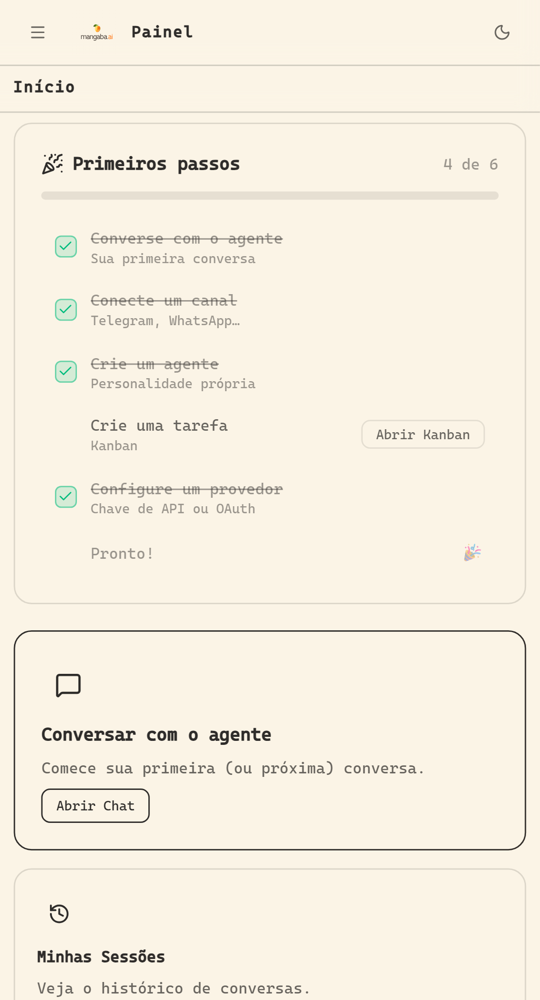
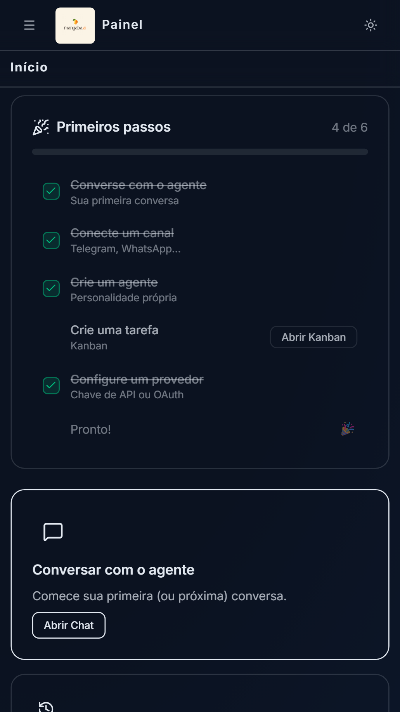
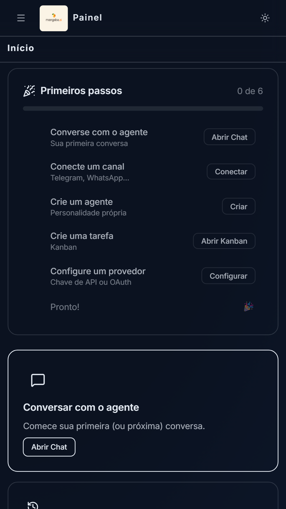

# 🖼️ Guia Visual - Mangaba Agent Dashboard

Referência visual com screenshots reais do aplicativo.

---

## 📸 Screenshots

### 1. Home Page - Desktop

**Tela inicial ao fazer login**



**O que você vê:**
- Bem-vindo ao Mangaba Agent
- Resumo de agentes ativos
- Últimas atividades
- Botões de ação rápida
- Menu lateral com navegação

---

### 2. Navegação - Sidebar

**Menu lateral com todas as opções**



**Seções do menu:**
- 🏠 **Começar** - Home e ajuda
- 💬 **Conversar** - Chat e sessões
- ⚡ **Agentes** - Criar, gerenciar, conectar
- ⚙️ **Configurar** - Preferências e avançado
- 🔄 **Automatizar** - Agendamentos e tarefas
- 📋 **Acompanhar** - Logs e documentação

---

### 3. Chat - Interface de Conversa

**Tela de chat com agentes**



**Componentes:**
- Área de mensagens (histórico)
- Campo de entrada de texto
- Botão enviar
- Indicador de status do agente
- Sugestões automáticas (se houver)

**Como usar:**
1. Digite sua mensagem
2. Pressione Enter ou clique Enviar
3. Aguarde resposta do agente
4. Continue a conversa normalmente

---

### 4. Tema - Claro e Escuro

**Botão de tema na barra superior**


**Opções disponíveis:**
- 🌙 **Modo Noite** - Fundo escuro, economiza bateria
- ☀️ **Modo Dia** - Fundo claro, contraste alto
- 🔄 **Automático** - Muda conforme hora do dia

**Como mudar:**
1. Clique no ícone de lua/sol no topo
2. Selecione tema desejado
3. Muda instantaneamente
4. Preferência é salva automaticamente

---

### 5. Mobile - Responsividade

**Como aparece em smartphone**



**Adaptações para mobile:**
- Menu hambúrguer (☰) no topo
- Layout coluna única
- Botões maiores para toque
- Texto legível
- Funciona em retrato e paisagem

**Como navegar:**
1. Clique ☰ para abrir menu
2. Toque em qualquer seção
3. Menu fecha automaticamente
4. Deslize para ver mais conteúdo

---

## 🎯 Fluxos Principais

### Fluxo 1: Login e Home

```
Navegador → URL do Dashboard
         ↓
Tela de Login (email + senha)
         ↓
Clique [Conectar]
         ↓
HOME PAGE (primeira imagem acima)
         ↓
Você está dentro!
```

### Fluxo 2: Conversar com Agente

```
HOME PAGE
     ↓
Clique "Chat" no menu
     ↓
TELA DE CHAT (terceira imagem)
     ↓
Digite sua mensagem
     ↓
Pressione Enter
     ↓
Aguarde resposta
     ↓
Continue conversando
```

### Fluxo 3: Mudar Tema

```
Em qualquer página
     ↓
Clique 🌙 ou ☀️ no topo
     ↓
Selecione tema
     ↓
Dashboard muda de cor
     ↓
Preferência salva
```

### Fluxo 4: Usar em Smartphone

```
Abrir URL em mobile
     ↓
VERSÃO MOBILE CARREGA
     ↓
Clique ☰ (hamburger)
     ↓
Menu desliza
     ↓
Toque em qualquer item
     ↓
Navega para página
     ↓
Menu fecha
```

---

## 💡 Dicas Práticas

### ✓ Desktop é Melhor Para:
- Usar por muitas horas
- Trabalhar com múltiplos agentes
- Análise de logs
- Configurações avançadas
- Exportar dados

### ✓ Mobile é Bom Para:
- Verificações rápidas
- Chat em qualquer lugar
- Responder mensagens
- Emergências
- Primeira consulta

### ✓ Atalhos Úteis:
| Ação | Resultado |
|------|-----------|
| Clique 🌙 | Muda tema |
| Pressione ⌘K | Busca rápida |
| Pressione Esc | Fecha menu/popup |
| Pressione Tab | Navega elementos |
| Em mobile: ☰ | Abre menu |

---

## 🎬 Vídeos de Teste (Disponíveis)

Os testes E2E do Playwright geraram vídeos de cada ação:

**Localização:** `test-results/*/video.webm`

**O que mostram:**
- Navegação funcionando
- Chat em tempo real
- Tema mudando
- Responsividade
- Fluxos completos

**Como ver:**
1. Vá para `test-results/`
2. Procure pasta com seu teste
3. Abra `video.webm` no navegador

---

## 📊 Comparação: Desktop vs Mobile

| Aspecto | Desktop | Mobile |
|---------|---------|--------|
| **Tamanho** | 1280+ px | 375 px (máx) |
| **Menu** | Sempre visível | Hambúrguer |
| **Layout** | 2+ colunas | 1 coluna |
| **Botões** | Pequenos | Grandes |
| **Scroll** | Menos necessário | Mais frequente |
| **Melhor para** | Trabalho | Verificação rápida |

---

## ✨ Características Visuais

### Paleta de Cores

**Tema Claro:**
- Fundo: Branco (#FFFFFF)
- Texto: Preto/Cinza escuro
- Destaque: Azul/Verde

**Tema Escuro:**
- Fundo: Cinza escuro (#1A1A1A)
- Texto: Branco/Cinza claro
- Destaque: Azul/Verde (mesmo)

### Tipografia

- **Títulos:** Fonte maior, bold
- **Corpo:** Fonte padrão, legível
- **Código/Monospace:** Fonte fixa (para IDs, etc)

### Ícones

- 🏠 Home
- 💬 Chat/Mensagens
- ⚙️ Configurações
- 📊 Logs/Analytics
- ✓ Sucesso
- ✕ Erro
- ⚠️ Aviso
- ℹ️ Informação

---

## 🖱️ Interações

### Hover (Desktop)
- Botões mudam cor ao passar mouse
- Links mudam cor
- Fundo muda em linhas clicáveis

### Clique/Tap
- Ativa ação
- Muda de página
- Abre menu/modal
- Envia mensagem

### Teclado
- Tab: navega entre elementos
- Enter: ativa elemento
- Esc: fecha menu/dialog
- ⌘K: busca rápida

---

## 📱 Tamanhos de Tela Testados

| Dispositivo | Resolução | Testado? |
|-------------|-----------|----------|
| Laptop | 1280x720 | ✓ Yes |
| Desktop | 1920x1080 | ✓ Yes |
| Tablet | 768x1024 | ✓ Yes |
| Smartphone | 375x667 | ✓ Yes |
| Pequeno | 320x568 | ✓ Yes |

---

## 🔗 Próximas Etapas

1. **Ver Screenshots:** Abra as imagens acima em resolução alta
2. **Explorar:** Navegue cada seção do dashboard
3. **Comparar:** Relate o que você vê com as imagens
4. **Praticar:** Use cada funcionalidade
5. **Ler Guia:** Leia `GUIA_DO_USUARIO.md` para detalhes

---

## ❓ Não Encontrou?

Se uma seção não tem screenshot:
- Verifique `GUIA_DO_USUARIO.md` para descrição
- Use diagramas ASCII como referência
- Reporte no FAQ se tiver dúvida
- Contate suporte para demo ao vivo

---

**Referência Visual Completa** 🎉

Agora você tem screenshots reais para guiar-se!

---

**Última atualização:** 2026-07-07  
**Screenshots:** Do Playwright E2E Tests  
**Qualidade:** Real (não mockups)
